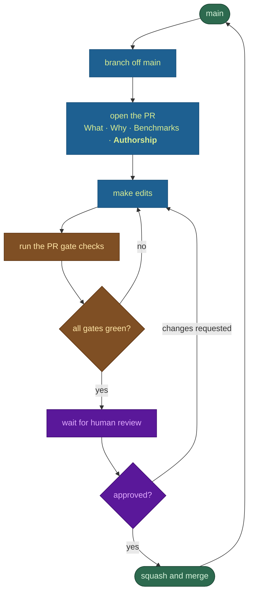
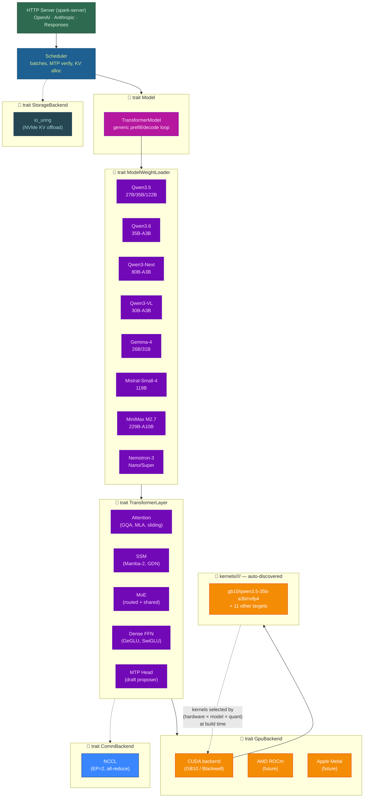

<p align="center">
  
</p>

> [!IMPORTANT]
> **Ling 3.0 Flash on NVIDIA GB10.** This public AGPL derivative adds native
> Bailing Hybrid KDA/MLA, NVFP4, 512-expert MoE, and MTP support for
> `kingjones777/Ling-3.0-flash-NVFP4-SGLang-MTP`. Start with the
> [GB10 deployment guide](docs/LING3_GB10.md), review the
> [benchmark report and charts](docs/benchmarks/ling-gb10/README.md), and see
> [MODIFICATIONS.md](MODIFICATIONS.md) for provenance. Model weights are not
> included.

> This repository was modified on 2026-08-25 from Atlas commit
> [`a046cdfd`](https://github.com/Avarok-Cybersecurity/atlas/commit/a046cdfdead4b75dc43f6ec346b04733d136d081).
> The complete corresponding source is this repository under AGPL-3.0-only.
<p align="center">
  <h1 align="center">Atlas Inference Engine</h1>
  <p align="center">
    <strong>Pure Rust LLM Inference</strong><br>
    <em>Universal Inference At Unimaginable Speeds</em>
  </p>
  <p align="center">
    
    
    
  </p>
  <p align="center">
    <a href="LICENSE"></a>
    <a href="#quick-start"></a>
    <a href="https://hub.docker.com/r/avarok/atlas-gb10"></a>
    <a href="https://discord.gg/RQcGakU2jW"></a>
  </p>
</p>

<p align="center">
  <a href="assets/atlas-demo.mp4"></a>
</p>

<p align="center">
  <a href="#quick-start"></a>
  <a href="https://atlasinference.io"></a>
</p>

---

## 📑 Table of Contents

- [🧭 Philosophy](#philosophy)
- [🏛️ Architecture](#architecture)
- [📦 What We Ship Today](#models)
- [⚡ Performance](#performance)
- [🗜️ KV Cache Quantization](#kv-cache)
- [🚀 Quick Start](#quick-start)
- [🔬 Kernel Debugging](#debugging)
- [🔌 Adding a New Hardware Target](#new-hardware)
- [🧬 Adding a New Model](#new-model)
- [📚 Citations](#citations)
- [⚖️ License and Enterprise Edition](#license)

---

<a id="philosophy"></a>

## 🧭 Philosophy

The foundation of any given field of science is philosophy. It is that which inspires direction, structure, and mission.

Atlas began as a solution to widely known problem in using other (python) inference engines built by data scientists: the code was steeped in a poly codebase with an ever shifting ecosystem of dependencies, patches, and cross-dependencies. One day your workaround for running a model works, the next day you have to update to a nightly branch of several dependencies and inject a new workaround. This is not how you build a software ecosystem; that's how you build a proof of concept. We thank the great and hard work data scientists made in proving LLMs can revolutionize our world, its economy, and how it challenges us to higher epochs. Now, the software engineers take the torch to turn a proof of concept into something that is designed to withstand the test of time.

### Main Objective

Similar to how llama.cpp was built with the intent to prove you don't need $10000-$100000 GPUs to run LLMs, Atlas is built with the intent to consistently force the narrative that as hardware continues to advance, we should not have to pay premium Cloud API prices for inference. Atlas, by virtue of its philosophy, maximizes speed for each hardware/model combination, thus paving the way for meaningfully powerful and intelligent LLMs to be run locally in such a way the model is truly useful.

### Design Choices

#### Free and Open Source, Always

We promised this since the beginning. We believe great software comes from opening the source, not from just keeping it closed. The more eyes, the better. And therein brings us to the next point.

#### Community-First

For those who've followed us this far since the inception of our Discord, you know the extent to which our commitment to the community is, according to one user humourously put, "cracked". We want to build something incredible, and that means we not only build for you, but you, now having access to the source code, can now build for others in ways that triumph over existing solutions. This is the only way we all win. We are the Pirates of the inference space.

#### Monorepo

We chose a monorepo design to ensure that, as we head further into the agentic age of coding, the average data scientist or engineer can contribute meaningful PRs to any part of the system. Eventually, since this is a monorepo, there will be a day where the repo is autonomously self-improving and self-patching. This is most efficient and most effective when all the code is in one place, not many.

#### Hardware+Model Specific Kernels

We make no compromises or generalizations. Each hardware and model combination has its own unique properties that require fine-tuning custom kernels that leverage the model for that specific hardware configuration. The end result? 2-3x faster kernels all around.

#### AI-Friendly Codebase

It took a significant amount of time to build this codebase. We also know people will want to submit AI-generated PRs. We can't stop you, and in fact, given SOTA, you might just have to! The good news is that this codebase was built with enough railguards, structure, and abstraction to guide your AI to absorb the entire monorepo and contribute meaningfully. There's enough context to keep this going off the rails like a crazy train.This means ultimately that instead of waiting for days to weeks before getting model support, you can just fork this repo, and ask your AI to integrate it, then within hours you'll more likely than not have a working model running. We will not be condescending, [unlike some other inference engines out there when good-faith PRs that simply work are posted](https://github.com/ggml-org/llama.cpp/pull/18680#issuecomment-3723954542). We are not stymied by bureacracy, and want to enable the community to rapidly expand this monorepo ecosystem safely and effectively.

**AI-authored PRs are the default, and the target.** If you write code by hand,
we ask you to say which parts and why the human beat the AI — not to discourage
you, but because every such case marks a gap in the tooling that we would rather
close than live with. The intent is that the share of hand-written code trends
toward zero. Human-written sections are reviewed by AI to check that claim, and
if the review finds the human was right, that is a result worth keeping.

The contribution loop has exactly two exits — merge, or back to editing:



The per-state commands, exit conditions and the invariants an agent must not
violate are in [`CONTRIBUTING.md`](CONTRIBUTING.md#pull-request-process) — in a
table, because an agent should not have to infer the contract from prose.

#### Theory-Friendly Codebase

Arxiv is getting countless papers published every day on AI. Nobody can keep up. Yet, some papers may be relevant to this project, others may not. Research endeavors to improve quality, alignment, and speed ought to be considered by our community as something we can integrate cleanly. Feel free to open a PoC PR here and just explain what you did and why, and how it works.

#### Plug and Play Design

Our system is modular, with tight abstraction boundaries and trait requirements that force the architecture to take on a certain form. This form is designed to prevent pigeon-holing the project into the wrong direction. The business logic is the same across all hardware/model combinations, just the concrete implementations differ.

<a id="architecture"></a>

## 🏛️ Architecture

The diagram below shows how a single HTTP request flows from the API surface down to hardware-specific CUDA kernel execution. **Dashed borders** mark the **plug-and-play** abstraction boundaries — the traits and registries where a new hardware target, model family, communication backend, or storage backend plugs in without touching the layers above or below it.



### Reading the Diagram

**Solid boxes** are concrete implementations. **Dashed borders with 🔌** are the trait-based abstraction boundaries — each is a Rust trait (or a filesystem convention for kernels) where a new integration plugs in:

| Plug Point | What It Abstracts | To Add New Support |
|---|---|---|
| `trait Model` | Full model forward pass | Rarely needed — the existing `TransformerModel` handles all architectures via composable layers |
| `trait ModelWeightLoader` | HuggingFace → layer translation | **Implement one struct** with weight-name patterns for your model family ([`factory.rs`](crates/spark-model/src/factory.rs) adds one match arm) |
| `trait TransformerLayer` | Per-layer compute (attn, SSM, MoE, FFN) | Compose existing layer types or implement a new one for novel architectures |
| `trait GpuBackend` | All GPU memory and kernel ops | Swap the CUDA driver for another accelerator backend |
| `kernels/<hw>/<model>/<quant>/` | Hardware-tuned CUDA kernels | Drop a new directory with `MODEL.toml` + `.cu` files; `build.rs` auto-discovers it |
| `trait CommBackend` | Multi-GPU collective communication | Implement for MPI, GDR, or custom interconnects |
| `trait StorageBackend` | NVMe KV-cache offload I/O | Implement for CXL, RDMA, or other storage tiers |

### Data Flow Summary

1. **HTTP** → `spark-server` receives OpenAI/Anthropic requests, tokenizes, and enqueues
2. **Scheduler** → batches sequences, orchestrates prefill/decode/speculative-verify steps
3. **Model** → generic loop: `embed → [layer₀ … layerₙ] → norm → lm_head`
4. **Layers** → each layer dispatches through `GpuBackend` to launch kernels from `AtlasRegistry`
5. **Kernels** → pre-compiled PTX selected by `(hardware × model × quant)` target at build time
6. **EP** → `CommBackend` handles cross-GPU all-reduce after MoE expert computation
7. **Storage** → `StorageBackend` spills/restores KV blocks to NVMe for long-context sequences

<a id="models"></a>

## 📦 What We Ship Today

We have to walk before we can run. Today's Atlas is targeted at a single hardware platform — NVIDIA's GB10 (DGX Spark, SM121) — and fifteen hand-tuned (Hardware × Model × Quantization) targets. Every supported model below runs off one multi-model binary; the right kernel set is selected at startup from the model's `config.json`. No swapping images, no rebuilding, no per-model magic — just point Atlas at a HuggingFace ID.

| Family | Model | HuggingFace ID | Params / active | Architecture |
|---|---|---|---:|---|
| Qwen3.5 | Qwen3.5-27B | `Kbenkhaled/Qwen3.5-27B-NVFP4` | 27B dense | Hybrid SSM + attention, dense FFN, MRoPE |
| Qwen3.5 | Qwen3.5-35B-A3B | `Sehyo/Qwen3.5-35B-A3B-NVFP4` | 35B / 3B | GDN + attention + MoE, MTP |
| Qwen3.5 | Qwen3.5-122B-A10B | `Sehyo/Qwen3.5-122B-A10B-NVFP4` | 122B / 10B | GDN + attention + MoE, MTP |
| Qwen3.6 | Qwen3.6-35B-A3B | `Qwen/Qwen3.6-35B-A3B-FP8` | 35B / 3B | GDN + attention + MoE, MRoPE, vision tower |
| Holo-3.1 | Holo-3.1-35B-A3B | `Hcompany/Holo-3.1-35B-A3B-NVFP4` | 35B / 3B | GDN + attention + 256-expert MoE, Qwen3-VL vision |
| Holo-3.1 | Holo-3.1-0.8B | `Hcompany/Holo-3.1-0.8B` | 0.8B dense | GDN + attention + dense FFN, Qwen3-VL vision |
| Ornith | Ornith-1.0-9B | `deepreinforce-ai/Ornith-1.0-9B` | 9B dense | GDN + attention + dense FFN, Qwen3-VL vision, MRoPE |
| Qwen3-Next | Qwen3-Next-80B-A3B | `nvidia/Qwen3-Next-80B-A3B-Instruct-NVFP4` | 80B / 3B | SSM + attention + MoE |
| Qwen3-VL | Qwen3-VL-30B-A3B | `ig1/Qwen3-VL-30B-A3B-Instruct-NVFP4` | 30B / 3B | Vision + attention + MoE |
| Gemma-4 | Gemma-4-26B-A4B | `bg-digitalservices/Gemma-4-26B-A4B-it-NVFP4A16` | 26B / 4B | Attention + MoE, GeGLU |
| Gemma-4 | Gemma-4-31B | `nvidia/Gemma-4-31B-IT-NVFP4` | 31B dense | Attention (sliding + full), GeGLU |
| Mistral | Mistral-Small-4-119B | `mistralai/Mistral-Small-4-119B-2603-NVFP4` | 119B / 6.5B | Attention + MoE |
| MiniMax | MiniMax-M2.7 | `lukealonso/MiniMax-M2.7-NVFP4` | 229B / ~10B | Attention + 256-expert MoE + MTP |
| Nemotron-H | Nemotron-3-Nano-30B-A3B | `nvidia/NVIDIA-Nemotron-3-Nano-30B-A3B-NVFP4` | 30B / 3B | Mamba-2 + attention + MoE |
| Nemotron-H | Nemotron-3-Super-120B-A12B | `nvidia/NVIDIA-Nemotron-3-Super-120B-A12B-NVFP4` | 120B / 12B | Mamba-2 + attention + MoE |

This is a starting point, not a destination. The plug-and-play design above exists precisely so that AMD, Apple Silicon, Intel, and the next round of Blackwell parts can land here as community contributions, and so that the Llama 4s and DeepSeek V4s of next quarter slot in the same way the Qwens did this quarter. We did the hard part — bolting in the abstractions while bringing up the first fifteen targets — so that adding the sixteenth is a weekend, not a quarter.

> **New to Atlas on a Spark?** The [**GB10 Deployment & Compatibility Guide**](docs/GB10_DEPLOYMENT_GUIDE.md) is the one page to read first: which model and quant fit your box and your goal, what to do when it OOMs, the known gotchas, and what "verified" means — then it hands you the exact recipe. If you're deciding *what to run*, start there.

<a id="performance"></a>

## ⚡ Performance

We're not going to spend much real estate on benchmark theatre. The numbers below are what the binary in this repository does on a single NVIDIA GB10, on a short prompt (`"What is the capital of France?"`, `max_tokens ≤ 30`, `temperature = 0.1`), measured end-to-end through the HTTP API. They are reproducible: `scripts/sweep_all_models.sh` is the harness, and the source for every kernel that produced them is in this repository.

| Model | Mode | tok/s |
|---|---|---:|
| Qwen3.5-35B-A3B | MTP speculative (K=2) | **131** |
| Qwen3.5-35B-A3B | turbo4 KV | 77 |
| Qwen3.5-35B-A3B | No speculative | 70 |
| Qwen3-Next-80B-A3B | FP8 KV | 74 |
| Qwen3.5-122B-A10B | EP=2, MTP K=2 (600-tok sustained) | 46 |
| Qwen3.5-122B-A10B | FP8 KV, single-GPU tuned | 32 |
| Qwen3-VL-30B-A3B | NVFP4 KV | 97 |
| Nemotron-3-Nano-30B-A3B | FP8 KV | 88 |
| Nemotron-3-Super-120B | FP8 KV | 24 |
| Gemma-4-26B-A4B | default | 67 |
| Gemma-4-31B | `--max-batch-size 2` | 9 |
| Mistral-Small-4-119B | NVFP4 | 33 |
| Qwen3.5-27B (dense hybrid) | FP8 KV | 13 |

We compete with vLLM and TensorRT-LLM on the same GB10. On Qwen3.5-35B-A3B with MTP speculative decoding, Atlas decodes faster than the same model under NVIDIA's own vLLM build on the same hardware — meaningfully faster, on numbers we can hand you the script for. We will not put a bigger figure in this paragraph than the one that comes off our own benchmark scripts, and we publish the vLLM baseline command alongside ours so you can verify both. If you reproduce a faster vLLM number, file an issue. We would rather be measured than congratulated.

The kernel-by-kernel comparison against PyTorch eager lives in the [benchmarks chapter](book/src/operations/benchmarks.md) along with the methodology footnotes — read them; they matter. That table is **32 benchmark rows over ~11 kernel families** (attention, GEMM, W4A16, MoE, conv1d, GDR, RMSNorm, SiLU×Mul, RoPE), all wins; it is not a sweep of the whole registry. The registry itself is much larger — `kernels/gb10/common/` alone holds 160 `.cu` files defining 318 `extern "C" __global__` entry points, before the per-model shadow directories.

<a id="kv-cache"></a>

## 🗜️ KV Cache Quantization

Atlas stores attention key/value state in a quantized format selected via `--kv-cache-dtype`. Lower bit-widths fit more tokens in GPU memory at the cost of precision; the Turbo family adds Walsh-Hadamard rotation and Lloyd-Max optimal codebooks to recover accuracy at the same bit rate. Mix dtypes per layer with `--kv-high-precision-layers` to keep boundary layers at BF16 while compressing the middle.

The table below is the **symmetric** set — the same format for K and V. `KvCacheDtype` (`crates/spark-runtime/src/kv_cache.rs`) accepts **16 values in total**: the six below plus `turbo2` (2-bit) and nine TurboQuant+ **asymmetric** K/V pairings (`turbo4k_turbo3v`, `turbo4k_turbo8v`, `turbo3k_turbo8v`, `bf16k_turbo4v`, `bf16k_turbo3v`, `bf16k_turbo2v`, `fp8k_turbo4v`, `fp8k_turbo3v`, `fp8k_turbo2v`) that store K at higher precision than V, since K dominates attention-score fidelity. Those are documented in [`docs/turboquant-plus.md`](docs/turboquant-plus.md); the parser is the authority on the accepted spelling.

| CLI flag | Bits/element | Scale overhead | Technique | When to use |
|---|---:|---|---|---|
| `bf16` | 16 | — | Raw BF16 storage | Maximum precision; short-context or quality-critical workloads |
| `fp8` | 8 | Per-tensor FP32 scale (from checkpoint or online calibration via `--fp8-kv-calibration-tokens`) | FP8 E4M3 with static or calibrated per-tensor scale | **Default.** Safe baseline — half the memory of BF16, minimal quality loss for most models |
| `turbo8` | 8 | Per-group BF16 scale (2 bytes / 16 elements) | Walsh-Hadamard rotation → FP8 E4M3 + BF16 per-group scales | FP8-level memory with outlier suppression; recommended for many-layer models (e.g. MiniMax M2.7, 58 layers) where per-group FP8 scales compound |
| `nvfp4` | 4 | Per-group FP8 scale (1 byte / 16 elements) | E2M1 packed nibbles (NVIDIA NVFP4 format) | 4× compression vs BF16; good for long-context with `--kv-high-precision-layers auto` |
| `turbo4` | 4 | Per-group FP8 scale (1 byte / 16 elements) | Walsh-Hadamard rotation → Lloyd-Max optimal 4-bit codebook | ~2× lower MSE than NVFP4 at the same bit rate; same memory footprint |
| `turbo3` | 3 | Per-group FP8 scale (1 byte / 16 elements) | Walsh-Hadamard rotation → Lloyd-Max 3-bit codebook (8 levels, packed 8 values → 3 bytes) | Maximum compression (22% smaller than turbo4); experimental |

<a id="quick-start"></a>

## 🚀 Quick Start

The whole supported model matrix lives in one Docker image. Pull it, mount your HuggingFace cache, point Atlas at any model ID from the [model table](#models).

> **Defaults below are tuned for maximum accuracy under agentic-coding workloads** — 64K context window, BF16 MTP draft head (highest acceptance rate ⇒ highest end-to-end throughput), prefix caching for multi-turn tool loops, and FP8 KV cache with `auto`-promoted boundary layers. These are the recipes we use to drive opencode / Claude Code / Cline through Atlas on a single Spark.

### Recipe 0 — no flags, pick a model in the TUI

Omit the model ID and `serve` boots into the Library — pick a model and recipe interactively (TTY only):

```bash
docker run -it --rm --network host --gpus all --ipc=host -v "${HOME}/.cache/huggingface:/root/.cache/huggingface" -v "${HOME}/.atlas:/root/.atlas" avarok/atlas-gb10:latest serve
```

- `-it` — the TUI needs a real terminal to render (and Esc to quit).
- `--rm` — throwaway container; nothing to clean up after the session.
- `--network host` — the served port is reachable on localhost directly, no `-p` mapping.
- `--gpus all` — hands the GB10 to the container.
- `--ipc=host` — host-sized shared memory; the Docker default 64 MB `/dev/shm` is too small for CUDA.
- `-v ~/.cache/huggingface` — reuse the host's model cache instead of re-downloading weights.
- `-v ~/.atlas` — persist Atlas state (recipes, benchmark records, artifacts) across runs.

<a id="run-atlas"></a>

### Recipe A — Qwen3.6-35B-A3B (FP8 hybrid MoE, ~130 tok/s)

The default daily driver — 35 B params, 3 B active, GDN + attention + 256-expert MoE, MRoPE-positioned vision tower (text-only here).

```bash
docker pull avarok/atlas-gb10:latest

sudo docker run -d --name atlas \
  --network host --gpus all --ipc=host \
  -v ~/.cache/huggingface:/root/.cache/huggingface \
  avarok/atlas-gb10:latest \
  serve Qwen/Qwen3.6-35B-A3B-FP8 \
    --port 8888 \
    --max-seq-len 65536 \
    --kv-cache-dtype fp8 \
    --kv-high-precision-layers auto \
    --gpu-memory-utilization 0.90 \
    --scheduling-policy slai \
    --enable-prefix-caching \
    --speculative \
    --num-drafts 2 \
    --tool-call-parser qwen3_coder
```

Why these flags:

- `--max-seq-len 65536` — 64K window for long agent traces, file reads, multi-step tool use.
- `--kv-cache-dtype fp8 --kv-high-precision-layers auto` — half the memory of BF16, no measurable quality loss; the boundary attention blocks stay BF16, where the routing distribution is most sensitive. `auto` is **not** a heuristic — it is a fixed alias for `2` (`serve_phases/kv_cache.rs`), alongside `max`/`all` meaning "every attention layer". Because it is non-zero it also *suppresses* the per-dtype automatic promotion that `0` would trigger under a `turbo*` KV dtype.
- `--scheduling-policy slai` — SLAi scheduler. **Not the default** — `serve` defaults to `fifo`, so this flag has to be passed to get SLO-aware ordering. It reorders concurrent sequences to keep MTP verify batches dense and prefills shortest-prompt-first.
- `--enable-prefix-caching` — radix-tree prefix cache; tool-use sessions reuse the system prompt + tool-defs + earlier turns.
- `--speculative --num-drafts 2` — MTP draft head proposes 2 tokens per step. **No `--mtp-quantization` flag** ⇒ defaults to **BF16**, which gives the highest acceptance rate (lossier MTP projections lower acceptance and usually *worsen* end-to-end tok/s, despite the faster draft forward).
- `--tool-call-parser qwen3_coder` — explicit Qwen XML tool format. Atlas auto-resolves the right parser from `tool_defaults.toml` per model; pass it anyway in production scripts.

### Recipe B — Qwen3.5-35B-A3B (NVFP4, ~131 tok/s with MTP K=2)

The fastest model in the matrix on a single Spark.

```bash
sudo docker run -d --name atlas \
  --network host --gpus all --ipc=host \
  -v ~/.cache/huggingface:/root/.cache/huggingface \
  avarok/atlas-gb10:latest \
  serve Sehyo/Qwen3.5-35B-A3B-NVFP4 \
    --port 8888 \
    --max-seq-len 65536 \
    --kv-cache-dtype fp8 \
    --kv-high-precision-layers auto \
    --gpu-memory-utilization 0.90 \
    --scheduling-policy slai \
    --enable-prefix-caching \
    --speculative \
    --tool-call-parser qwen3_coder
```

`--num-drafts` is omitted so it defaults to `1`, i.e. MTP **K=2** (the CLI defines `--num-drafts 1` as K=2, `2` as K=3). K=2 is the measured-fastest verify width for this model; K=3 is slower.

### Recipe C — Qwen3.5-122B-A10B (NVFP4, single Spark)

The 122B NVFP4 weights + Atlas runtime overhead leave only ~2 GB for KV cache on a 119.7 GB GB10, so this recipe sacrifices `--speculative` (the MTP draft head + draft KV costs ~1.5 GB) to keep a real 16 K context window.  Verified end-to-end: model loads, `/v1/chat/completions` answers correctly, 4-way concurrent serves cleanly.

```bash
sudo docker run -d --name atlas \
  --network host --gpus all --ipc=host \
  -v ~/.cache/huggingface:/root/.cache/huggingface \
  avarok/atlas-gb10:latest \
  serve Sehyo/Qwen3.5-122B-A10B-NVFP4 \
    --port 8888 \
    --max-seq-len 16384 \
    --kv-cache-dtype fp8 \
    --kv-high-precision-layers auto \
    --gpu-memory-utilization 0.92 \
    --scheduling-policy slai \
    --max-batch-size 1 \
    --max-num-seqs 4 \
    --oom-guard-mb 1024 \
    --ssm-cache-slots 0 \
    --tool-call-parser qwen3_coder
```

For 122B with **both** `--speculative` *and* a 64 K window, move to EP=2 across two Sparks ([`QUICKSTART.md`](QUICKSTART.md) §5). For long contexts on a single Spark, add `--high-speed-swap --high-speed-swap-dir /path/on/nvme --high-speed-swap-cache-blocks-per-seq 64` — HSS keeps a rolling 1024-token KV window in HBM and streams older blocks to NVMe through an io_uring orchestrator. The container needs `--security-opt seccomp=unconfined --ulimit memlock=-1` for io_uring access.

### Hitting the Endpoint

Atlas speaks OpenAI, Anthropic, and Responses APIs on the same port. `curl`, the OpenAI SDK, Open WebUI, opencode, Cline, Claude Code — point them at port 8888:

```bash
curl http://localhost:8888/v1/chat/completions \
  -H "Content-Type: application/json" \
  -d '{
    "model":"atlas",
    "messages":[{"role":"user","content":"Hello!"}],
    "max_tokens":256
  }'
```

Per-model recipes (vision input, video input, multi-node EP=2, single-GPU 122B with the tighter budget) live in [`QUICKSTART.md`](QUICKSTART.md).

> **Video input requires `ffmpeg` on the host.** Images need nothing extra, and animated GIF decodes in-process — but MP4/MOV, WebM and AVI (H.264, H.265, VP9, AV1) are decoded by running `ffmpeg`, which must be installed and enabled with `--video-allow-ffmpeg`. Atlas deliberately does not link a video decoder; see [`QUICKSTART.md`](QUICKSTART.md#2-qwen3-vl-30b-a3b-vision) for the recipe and the reasoning. Build-from-source instructions are in [`CONTRIBUTING.md`](CONTRIBUTING.md), and the kernel build pipeline is documented in [`docs/ARCHITECTURE.md`](docs/ARCHITECTURE.md#build-pipeline).

<a id="debugging"></a>

## 🔬 Kernel Debugging

Atlas exposes a focused set of **environment-gated diagnostic dumps** for tracking down quality regressions — magnitude drift, expert-routing skew, MoE under-counting, and the rest of the bug class where the kernels run cleanly but the output slowly degrades. The dumps are zero-overhead when their env var is unset (single `var()` lookup per call, no GPU sync, no copy) so leaving the production binary instrumented is safe.

**For the full diagnostic playbook** — including the cheapest-signal-first elimination ladder, how to build a byte-exact HF CPU oracle, the per-layer divergence comparator, and the methodological reversals that cost us hours — see [**`DEBUGGING_METHODOLOGY.md`**](DEBUGGING_METHODOLOGY.md). What follows is the env-var reference.

### MoE-path dumps — `ATLAS_DUMP_EXPERT_IDS=1`

Set `-e ATLAS_DUMP_EXPERT_IDS=1` on the container. The markers themselves live in one place — `crates/spark-model/src/layers/moe/dump.rs` — and every MoE path calls into it (`forward_prefill.rs`, `forward_prefill_fp8.rs`, `forward_prefill_bf16.rs`, `forward_prefill_routed.rs`, `forward_batched.rs`). They emit the following per-fire log lines, scoped to the **last token of the chunk** so the values are directly comparable to a single-pass reference forward at the same position:

| Log marker | Fires | What it captures | Use it to localize |
|---|---|---|---|
| `ATLAS_EXPERT_LOAD` | once / server | Per-expert histogram + `truncated=true/false` flag | Spot `max_m_tiles` truncation against actual routing skew |
| `ATLAS_GATE_INPUT` | per layer × chunk | post-norm router input (`\|x\|` + `first5`) | Verify the MoE block input matches the reference |
| `ATLAS_GATE_LOGITS` | per layer × chunk | top-10 `(idx, val)` + mean + std of raw gate logits | Catch gate-matmul drift before softmax/topK |
| `ATLAS_EXPERT_IDS` | per layer × chunk | top-K indices + renormalized weights + sum | Confirm routing decisions match HF |
| `ATLAS_ROUTED_ONLY` | per layer × chunk | routed sum **before** shared blend | Isolate the routed-expert contribution |
| `ATLAS_SHARED_OUT` | per layer × chunk | shared-expert output (pre-sigmoid) | Verify the dense FFN branch independently |
| `ATLAS_SHARED_GATE` | per layer × chunk | `dot(input, gate_weight)` + sigmoid value | Confirm shared-expert attenuation matches |
| `ATLAS_MOE_OUT` | per layer × chunk | final MoE block output (routed + blended) | The full-block ground truth vs the reference |

### SSM-path dumps

The SSM (GDN / Mamba-2) prefill in `qwen3_ssm/trait_prefill.rs` adds three pre-norm hooks under the same env var:

| Log marker | What it captures |
|---|---|
| `ATLAS_PRENORM_HIDDEN` | Residual stream entering this layer (= previous layer's output) |
| `ATLAS_PRENORM_OUTPROJ` | SSM `out_proj` output before residual add |
| `ATLAS_PRENORM_SUM` | hidden + out_proj (the input to `post_attention_layernorm`) |

Together, those plus the MoE dumps above give a complete trace of the residual stream at every layer boundary for any token in any chunk.

### Path-toggle env vars

For bisecting *which* code path is at fault, one override toggle lets you swap the routed-expert dispatch at runtime without rebuilding:

| Env var | Effect |
|---|---|
| `ATLAS_FORCE_NVFP4_MOE=1` | Routes an FP8 model's MoE through the NVFP4 path — useful for cross-validating that the bug is in one specific quant path. Read at `weight_loader/qwen35/load_layers.rs`, so it applies to the Qwen3.5/3.6 loader family, not to every FP8 checkpoint |

There is no longer an FP8 grouped-GEMM v1/v2 selector: `moe_fp8_grouped_gemm` is a single
grid-compaction kernel (`kernels/gb10/common/moe_fp8_grouped_gemm.cu`), and the
`ATLAS_FP8_MOE_COALESCED` gate that once chose between them has no read site in the tree.

### How we use these in practice — 3-step workflow

The order matters; this is the same workflow that found and fixed three compounding MoE bugs (commits `6a5fd3d`, `34626d3`, `adf39ce`, `ffdb41d`) on the Qwen3.6-A3B long-context investigation:

1. **Build an HF reference oracle.** A single-precision forward pass through HF Transformers on the same token IDs (read them back from Atlas's `/tokenize` — *do not* re-render the chat template), with `output_hidden_states=True` and per-layer hooks on `mlp.gate`, `mlp.shared_expert`, and `mlp.shared_expert_gate`. Record `\|x\|` + `first5` per layer for the last token.
2. **Spin up Atlas with `-e ATLAS_DUMP_EXPERT_IDS=1`.** Fire the same prompt. The MoE markers above give you per-layer Atlas values comparable to the oracle.
3. **Per-layer comparator.** A short script (the comparator pattern is captured in [`DEBUGGING_METHODOLOGY.md` §4](DEBUGGING_METHODOLOGY.md#4-per-layer-divergence-comparator)) prints `ratio = |Atlas| / |HF|` and `overlap = |top-K_Atlas ∩ top-K_HF|` per layer. The first layer where the ratio falls outside `[0.95, 1.05]` or overlap drops below 6/8 is your first-divergent layer — start drilling there.

For the 2026-05-20 MoE bug hunt this localized the issue from "16K context produces gibberish" to "L0 MoE output magnitude 3.4× too large because of three compounding bugs: v1 grouped-GEMM, missing zero-init, broken `max_m_tiles` heuristic" within a few iterations. After all three fixes, all 40 layers landed in `[0.977, 1.021]` of HF baseline — at the FP8 quantization noise floor.

<a id="new-hardware"></a>

## 🔌 Adding a New Hardware Target

The full recipe is in [`docs/HARDWARE.md`](docs/HARDWARE.md#adding-a-new-hardware-target). The short version: implement two traits (`ComputeTarget` for the build-time compiler, `GpuBackend` for the runtime), drop kernel sources into `kernels/<your-hw>/`, add one match arm in the registry. There is a `MockGpuBackend` in `spark-runtime` that lets you write and test the entire scaffold without owning the hardware — every layer above the GPU trait is hardware-agnostic, so unit tests can run on a laptop. We bolted the project from "single CUDA target" to "trait-pluggable across vendors" specifically so that the AMD, Apple, and Intel ports stop being our problem and start being yours.

<a id="new-model"></a>

## 🧬 Adding a New Model

Same story, smaller surface. Implement `ModelWeightLoader` (one struct, the existing `Qwen3AttentionLayer`/`MoeLayer`/`Qwen3SsmLayer`/`NemotronMamba2Layer` primitives cover most architectures), add one line to the factory dispatch, optionally drop a `MODEL.toml` for sampling defaults and behavior knobs. Kernels are reused; the scheduler is untouched; the server is oblivious. The step-by-step cookbook is in [`docs/HARDWARE.md`](docs/HARDWARE.md#adding-a-new-model-family). Once your loader produces coherent output on the integration coherence prompt, you are done — file the PR.

<a id="citations"></a>

## 📚 Citations

We did not invent the kernels we ship. We picked the right ideas from the right papers, fused them together, and tuned them for one chip until they pinned the bandwidth ceiling. Atlas owes a direct intellectual debt to:

- **FlashAttention-2** — Tri Dao. *FlashAttention-2: Faster Attention with Better Parallelism and Work Partitioning.* ICLR 2024. [arXiv:2307.08691](https://arxiv.org/abs/2307.08691) — tiled online softmax, Q/K/V SMEM staging, causal masking. Foundation of our prefill kernel.
- **FlashAttention-4** — Shah, Bikshandi, Zhang, Thakkar, Ramani, Dao. *FlashAttention-4: Taming the Hardware.* 2025. [arXiv:2603.05451](https://arxiv.org/abs/2603.05451) — conditional softmax rescaling and software polynomial `sw_exp` (3 FMA + `ldexpf` instead of going through the SFU). Both shipped in our GQA-fused paged Flash Attention.
- **FlashInfer** — Ye, Chen, Lai, Zhao, Zheng, Shao, Hou, Jin, Zuo, Yin, Chen, Ceze. *FlashInfer: Efficient and Customizable Attention Engine for LLM Inference Serving.* MLSys 2025 (Best Paper). [arXiv:2501.01005](https://arxiv.org/abs/2501.01005) — block-sparse paged KV cache, page index prefetch to SMEM, the gather-SMEM-MMA pattern for scattered pages. Informed our paged attention design.
- **SageAttention 3** — Zhang, Huang, Zhang, Wei, Zhu, Chen. *SageAttention3: Microscaling FP4 Attention on Blackwell GPUs.* NeurIPS 2025 Spotlight. [arXiv:2505.11594](https://arxiv.org/abs/2505.11594) — FP4 attention with FP8 per-block microscales. On the SM121 roadmap once silicon-level FP4 MMA arrives upstream.
- **LeanAttention** — Roy, Vassilieva, Willke, Mendis. *LeanAttention: Hardware-Aware Scalable Attention for LLM Inference.* 2024. [arXiv:2405.10480](https://arxiv.org/abs/2405.10480) — stream-K tile scheduling for near-100% SM occupancy in split-K decode attention. Planned next.
- **TurboQuant** — Zandieh, Daliri, Hadian, Mirrokni. *TurboQuant: Online Vector Quantization with Near-optimal Distortion Rate.* arXiv preprint, April 2025. [arXiv:2504.19874](https://arxiv.org/abs/2504.19874) — Randomized Hadamard Transform + Lloyd-Max codebook for KV cache compression. The implementation in our `kernels/gb10/common/wht_bf16.cu` + `reshape_and_cache_turbo.cu` follows the **TurboQuant+** extensions (matched-norm L2 correction, sparse V dequant, asymmetric K/V, InnerQ per-channel equalisation) collected at [`TheTom/turboquant_plus`](https://github.com/TheTom/turboquant_plus) (research umbrella) with the llama.cpp engine reference at [`TheTom/llama-cpp-turboquant`](https://github.com/TheTom/llama-cpp-turboquant); per-feature reproduction and prior-art chain in [`docs/turboquant-plus.md`](docs/turboquant-plus.md).

If you wrote one of these papers and you spot a misattribution or a wrong technique credit on our side, open an issue. We would rather be corrected than wrong.

<a id="license"></a>

## ⚖️ License and Enterprise Edition

Atlas operates under a **dual-license** model. Both are real, both are intentional, and neither is a teaser for the other.

1. **[Community Edition](LICENSE) — AGPLv3.** Free, open, copyleft. Use it for yourself to run inference on your own hardware, research, hobby projects, side-projects, and/or hosted demos, as examples. If you want to make money from Atlas, purchase a commercial license.
2. **Enterprise Edition — commercial license.** If you need to ship Atlas inside a closed-source product, run it as a SaaS backend without inheriting the AGPLv3 source-disclosure obligation, or simply want a support relationship with the people who wrote the kernels, contact sales. Enterprise customers also receive prioritized model and hardware ports.

This split exists for a single reason: a permissive license keeps us building Atlas full-time, and the AGPL community license keeps the project honest. What is in this repository is what we run.
