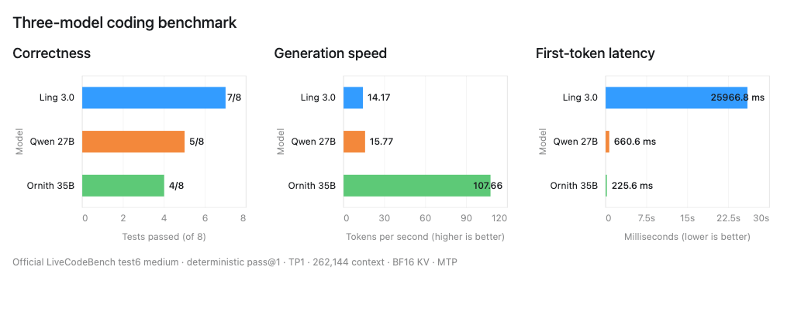

# GB10 coding benchmark

Eight official medium-difficulty LiveCodeBench test6 tasks were run once per
model with deterministic pass@1 generation. Every server used tensor
parallelism 1, a 262,144-token ceiling, BF16 KV cache, MTP, one active sequence,
and no prefix cache. Requests allowed up to 8,192 output tokens and used a
512-token thinking budget.

| Model | Correct | Median generation TPS | Median TTFT |
|---|---:|---:|---:|
| Ling 3.0 Flash NVFP4 + MTP | 7/8 | 14.17 | 25,966.8 ms |
| Qwen 3.8 27B NVFP4 + MTP | 5/8 | 15.77 | 660.6 ms |
| Ornith 1.5 35B NVFP4 + MTP | 4/8 | 107.66 | 225.6 ms |

Ling was the most accurate on this small suite, while Ornith generated much
faster and Qwen reached the first token much sooner than Ling. One Ling answer,
one Qwen answer, and three Ornith answers ended at the output limit. Treat the
results as a useful stress test, not a statistically broad ranking.

- [Interactive chart](three-model-coding-benchmark.html)
- [Full aggregate and per-task report](THREE_MODEL_REPORT.md)
- [Machine-readable summary](summary.csv)
- [Reproduce this exact second test](../../../benchmarks/livecodebench-test6-medium/README.md)

TPS is post-first-token generation throughput. TTFT is time to first token, so
lower is better. No private network addresses, copied task prompts, tests, or
model reasoning traces are included.

Only this second, eight-task test is included in the public repository. The
earlier mixed benchmark is intentionally excluded.
